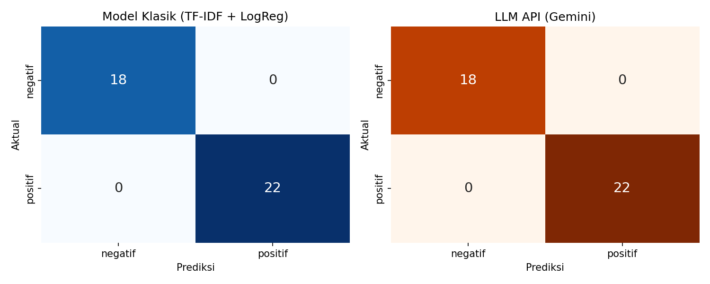
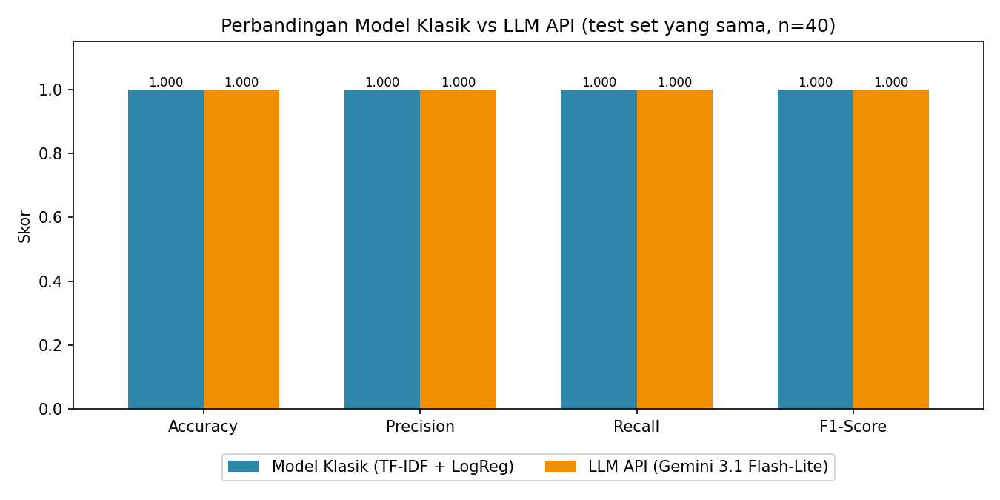

# AI Model Experiment & Evaluation - Sentiment Analysis Ulasan Pelanggan

Project ini membandingkan dua pendekatan untuk menentukan sentimen ulasan pelanggan e-commerce (positif atau negatif):

1. Model klasik: TF-IDF + Logistic Regression menggunakan Scikit-learn, dilatih dengan dataset yang tersedia.
2. LLM API: Gemini (`gemini-3.1-flash-lite`) menggunakan zero-shot prompt, tanpa proses training.

Kedua pendekatan diuji pada test set yang sama, kemudian dibandingkan menggunakan Accuracy, Precision, Recall, F1-Score, dan confusion matrix.

## Problem Statement

**Objective**
Tim produk e-commerce ingin memiliki fitur yang secara otomatis menandai sentimen ulasan di halaman produk. Sebelum memilih pendekatan untuk produksi, model klasik dan LLM API dibandingkan dari sisi performa, effort, kecepatan, dan biaya, kemudian disusun rekomendasi berdasarkan hasilnya.

**Label yang diprediksi**
Kolom `sentiment`:
- `positif`: pelanggan puas (barang bagus, pengiriman cepat, penjual ramah, dll).
- `negatif`: pelanggan kecewa (barang rusak atau tidak sesuai, pengiriman lambat, penjual tidak responsif, dll).

**Batasan dan asumsi**
- Dataset yang digunakan adalah dataset dari brief, dan file aslinya di folder `data/` tidak diubah.
- Label pada dataset dianggap benar. Hanya terdapat dua kelas, tanpa kelas netral.
- Fitur yang digunakan hanya `review_text`.
- Data dibagi 80/20 secara stratified (`random_state=42`), dan test set yang sama digunakan untuk kedua pendekatan.
- LLM digunakan tanpa fine-tuning. API key yang digunakan berada di free tier (20 request per hari per model), sehingga ulasan dikirim per batch berisi 10 ulasan dalam satu request.
- Perkiraan biaya menggunakan harga paid tier Gemini 3.1 Flash-Lite (input $0.25, output $1.50 per 1 juta token). Harga ini dapat berubah.

## Dataset

File: `data/customer_reviews_sentiment.csv`, berisi 200 ulasan berbahasa Indonesia.

| Kolom | Keterangan |
|---|---|
| `review_id` | ID ulasan |
| `product_name` | Nama produk (15 produk) |
| `review_text` | Isi ulasan, digunakan sebagai fitur |
| `sentiment` | Label, 110 positif dan 90 negatif |

Dataset tidak memiliki missing value dan distribusi labelnya cukup seimbang. Namun, dari 200 baris hanya terdapat 40 kalimat yang berbeda, karena kalimat yang sama digunakan berulang untuk produk yang berbeda. Akibatnya, 39 dari 40 kalimat pada test set juga muncul di data train.

## Eksperimen

**Model klasik**
- Teks diubah menjadi fitur numerik menggunakan metode TF-IDF (`TfidfVectorizer(ngram_range=(1, 2))`), sehingga frasa seperti "tidak sesuai" juga terbaca sebagai fitur.
- Model `LogisticRegression(max_iter=1000)` dilatih menggunakan 160 data train.
- Model kemudian digunakan untuk memprediksi 40 data test.

**LLM API (Gemini)**
- Prompt zero-shot berisi instruksi, penjelasan setiap label, dan catatan mengenai kalimat negasi ("tidak mengecewakan" = positif).
- `temperature=0` agar hasil prediksi konsisten dan dapat direproduksi.
- `thinking_level='minimal'` karena tugas klasifikasi ini sederhana, sehingga tidak memerlukan tambahan waktu dan token.
- Output dibatasi dalam format JSON dengan label `positif`/`negatif`.
- Satu request berisi 10 ulasan karena keterbatasan kuota free tier, sehingga total request yang digunakan adalah 4.
- Data test yang digunakan sama dengan model klasik, yaitu 40 ulasan.

## Hasil

Test set berisi 40 ulasan (18 negatif, 22 positif). Nilai Precision, Recall, dan F1 menggunakan rata-rata macro.

| Pendekatan | Accuracy | Precision | Recall | F1-Score | Training | Waktu prediksi per ulasan |
|---|---|---|---|---|---|---|
| Model Klasik (TF-IDF + LogReg) | 1.000 | 1.000 | 1.000 | 1.000 | sekitar 0.005 detik | sekitar 0.000005 detik |
| LLM API (Gemini 3.1 Flash-Lite) | 1.000 | 1.000 | 1.000 | 1.000 | tidak diperlukan | sekitar 0.52 detik |

Confusion matrix kedua pendekatan identik dan tidak terdapat kesalahan prediksi:

| | prediksi negatif | prediksi positif |
|---|---|---|
| aktual negatif | 18 | 0 |
| aktual positif | 0 | 22 |




Interpretasi nilai metrik:
- Accuracy 1.00 artinya seluruh ulasan diprediksi dengan benar.
- Precision 1.00 artinya tidak ada ulasan yang masuk ke kelas yang salah, misalnya keluhan yang diprediksi positif.
- Recall 1.00 artinya seluruh ulasan pada setiap kelas berhasil dikenali, sehingga tidak ada keluhan yang terlewat.
- F1 1.00 artinya precision dan recall sama-sama optimal.

Karena hasilnya sama, test set ini belum cukup untuk membedakan kedua pendekatan. Skor model klasik juga terbantu karena hampir seluruh kalimat test sudah dilihat saat training.

**Uji tambahan**
Kedua pendekatan juga diuji dengan 10 ulasan baru yang ditulis manual dengan gaya bahasa yang mirip ulasan asli (mengandung slang, sindiran, dan sentimen campuran). Pengujian ini hanya untuk melihat kelemahan masing-masing pendekatan, sehingga tidak dihitung dalam metrik utama.

| Pendekatan | Prediksi benar |
|---|---|
| Model Klasik | 6 dari 10. Keempat kesalahan berupa ulasan negatif yang diprediksi positif, dengan confidence rendah (0.50 sampai 0.72). |
| LLM API | 10 dari 10 |

**Biaya dan waktu LLM**
Untuk 40 ulasan digunakan 4 request. Rata-rata per ulasan sekitar 32 token input dan 21 token output. Biayanya sekitar $0.0016, atau diperkirakan sekitar $40 untuk 1 juta ulasan. Total waktu yang dibutuhkan sekitar 21 detik, sedangkan training dan prediksi model klasik hanya membutuhkan sekitar 0.005 detik.

## Analisis Trade-off dan Limitation

| Aspek | Model Klasik | LLM API |
|---|---|---|
| Skor pada test set | 1.00 (terbantu karena kalimat test terdapat di data train) | 1.00 |
| Ulasan dengan gaya bahasa baru | 6/10 | 10/10 |
| Effort | Memerlukan data berlabel, training, dan training ulang | Tidak memerlukan training, cukup merancang prompt |
| Kecepatan | Sangat cepat, berjalan secara lokal | Sekitar 0.5 detik per ulasan melalui jaringan |
| Biaya | Hampir tidak ada | Sekitar $40 per 1 juta ulasan |
| Ketergantungan | Tidak ada | Kuota, rate limit, dan versi model dari Google |

**Kelemahan model klasik:** tidak memahami konteks. Kalimat sindiran seperti "Bagus sih kalau tujuannya buat dibuang..." dan ulasan campuran seperti "Seller ramah tapi produknya cacat" salah diprediksi karena mengandung kata positif. Kata yang belum pernah muncul di data train (misalnya "zonk") tidak dikenali, sehingga model cenderung memprediksi positif. Jumlah datanya juga terlalu sedikit dan berulang.

**Kelemahan LLM API:** terdapat batas kuota dan rate limit. Pada eksperimen ini, free tier hanya mengizinkan 20 request per hari, sehingga ulasan harus dikirim per batch. Versi model juga dapat berubah; `gemini-2.0-flash` pada starter notebook sudah tidak tersedia. Selain itu, waktu responsnya lebih lambat, biaya bertambah sesuai jumlah ulasan, isi ulasan dikirim ke pihak ketiga, dan format output perlu dibatasi agar tetap konsisten.

## Rekomendasi

Pendekatan yang direkomendasikan untuk dikembangkan lebih lanjut adalah **LLM API (Gemini Flash-Lite)**. Ulasan diproses per batch di background, dan selama berjalan data berlabel dikumpulkan untuk pengembangan model klasik ke depannya.

Alasan:
1. Skor pada test set sama, tetapi untuk ulasan dengan gaya bahasa baru Gemini jauh lebih baik (10/10 dibanding 6/10). Seluruh kesalahan model klasik berupa keluhan yang diprediksi positif, padahal jenis kesalahan ini paling merugikan bagi tim produk.
2. Effort implementasinya paling kecil karena tidak memerlukan data berlabel dan training. Dataset saat ini (40 kalimat unik) belum cukup untuk melatih model klasik yang andal.
3. Biayanya terjangkau, sekitar $40 per 1 juta ulasan.
4. Waktu respons tidak terlalu kritis untuk kasus ini, karena label sentimen tidak harus tampil secara real-time dan dapat diproses di background.

Hal yang perlu disiapkan untuk produksi: menggunakan paid tier dan mekanisme retry, tetap menggunakan output JSON dan temperature 0, menyimpan hasil prediksi, mengunci versi model yang digunakan, serta memeriksa kualitas secara berkala dengan sampel yang dilabeli manual.

Model klasik lebih sesuai apabila jumlah ulasan sangat besar sehingga biaya API menjadi mahal, apabila dibutuhkan prediksi yang sangat cepat, atau apabila data tidak boleh dikirim ke pihak ketiga. Hasil prediksi Gemini dapat dimanfaatkan untuk membuat dataset berlabel yang lebih besar, kemudian model klasik dilatih ulang sebagai cadangan.

## Struktur Folder

```
model-experiment-assignment/
├── data/
│   └── customer_reviews_sentiment.csv
├── notebook/
│   ├── experiment_notebook.ipynb
│   └── starter_notebook.ipynb
├── documentation/
│   ├── model_comparison_summary.png
│   ├── confusion_matrix.png
│   ├── model_comparison.csv
│   ├── prediction_results.csv
│   ├── llm_predictions.csv
│   └── llm_predictions_uji_tambahan.csv
├── README.md
└── requirements.txt
```

## Cara Menjalankan

1. Install library yang dibutuhkan:
   ```bash
   pip install -r requirements.txt
   ```
2. Buat API key di [Google AI Studio](https://aistudio.google.com/apikey), lalu simpan sebagai environment variable.
   Linux / macOS / Git Bash:
   ```bash
   export GEMINI_API_KEY="api-key-anda"
   ```
   Windows PowerShell:
   ```powershell
   $env:GEMINI_API_KEY = "api-key-anda"
   ```
3. Buka `notebook/experiment_notebook.ipynb` di Jupyter atau VS Code, lalu jalankan semua cell (Run All).

Hasil dari Gemini API sudah tersimpan di `documentation/llm_predictions.csv` dan `documentation/llm_predictions_uji_tambahan.csv`. Selama file tersebut tersedia, notebook akan menggunakan hasil yang tersimpan sehingga kuota API tidak terpakai lagi. Untuk memanggil API ulang, ubah `USE_CACHE = False` pada bagian 5.3.
